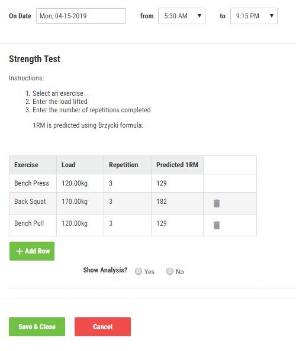

```{r setup, include = FALSE}
knitr::opts_chunk$set(
  collapse = TRUE,
  comment = "#>"
)
```

If you haven't already, please read the `getting-started` and `exporting-data` vignettes before proceeding: `vignette("getting-started")`, `vignette("exporting-data)`.

## Import functions

There are four general functions for importing data into Smartabase using `smartabaseR`: `sb_insert_event()`, `sb_update_event()`, `sb_upsert_event()` and `sb_upsert_profile()`. 

### sb_insert_event()

'Inserting' data into Smartabase means you are creating new events, which practically means you are adding new rows to the Smartabase event database. `sb_insert_event()` creates new events no matter what. This is the most commonly used import function and ensures no chance of existing events being updated/overwritten.

#### Example

```{r fake_training_data, echo = TRUE, paged.print = TRUE}
training_data <- dplyr::tibble(
  start_date = "13/01/2023",
  user_id = c(37204, 37201),
  about = c("Aiden Thomas", "Jamie Anderson"),
  distance = c(2530, 5411),
  rpe = c(5, 7),
  event_id = c(2381840, 2382033),
  entered_by_user_id = c(37204, 37201)
)

training_data
```


```{r insert_training, eval = FALSE}
sb_insert_event(
  df = training_data,
  form = "Team Summary"
)
```

```{r insert_rpe_success, echo = FALSE}
msg <- paste0("✔ SUCCESSFULLY_INSERTED: 2 out of 2 records successfully",
              "inserted into Team Summary.")
cat(msg)
```

### sb_update_event()

'Updating' data in Smartabase means you are editing existing events in the Smartabase event database. `sb_update_event()` requires a valid `event_id` column in the supplied data frame. These are unique IDs that ensure only the correct events are updated/overwritten.

#### Updating is the same as overwriting 

Important side note: we chose the term 'update' for `sb_update_event()` because it aligns with standard database terminology, but arguably a more appropriate name would be `sb_overwrite_event()`. 

That's because every event in the data frame supplied to `sb_update_event()` completely overwrites the matching event (according to the `event_id`) in the Smartabase event database. 

Practically this also means that most calls to `sb_update_event()` should be preceded by a call to `sb_get_event()`/`sb_sync_event()`. The latter return a data frame that contain the entire Smartabase form, including every column/field that contains data -- and not to mention the necessary `event_id` column.

#### Example

The example below represents a typical workflow that involves exporting data via `sb_get_event()`. The workflow involves exporting event data from Smartabase, applying some transformation and then importing the results using `sb_insert_event()`.

```{r example_get_for_update, eval = FALSE}
training_data <- sb_get_event(
  form = "Training Log",
  date_range = c("15/04/2023", "15/04/2023"),
  url = "example.smartabase.com/site",
  username = "example.username",
  password = "example_password"
)
```

```{r example_update_data, echo = FALSE}
training_data <- dplyr::tibble(
  form = "Training Log",
  start_date = "15/04/2023",
  user_id = c(37204, 37201),
  event_id = c(2381840, 2382033),
  Distance = c(2530, 5411),
  RPE = c(5, 7),
  `Team Average Distance` = c(NA, NA)
)

training_data
```

We have two records. Their event IDs are `2381840` and `238203`. 

Notice that the field `Team Average Distance` is currently empty. Let's imagine we want to populate that field with the team's average distance without creating new records. First, let's do the calculation:

```{r team_avg_calc, message = FALSE}
library(dplyr)

avg_dist_data <- training_data %>% 
  mutate(across("Team Average Distance", ~mean(Distance))) %>% 
  mutate(across("Team Average Distance", ~round(.)))

avg_dist_data
```

All we need to do now is import our `avg_dist_data` data back into our `Training Log` form via `sb_update_event()` and the `Team Average Distance` field will be populated:

```{r team_avg_update, eval = FALSE}
sb_update_event(
  df = avg_dist_data,
  form = "Training Log",
  url = "example.smartabase.com/site",
  username = "example.username",
  password = "example_password"
)
```

Running the above code will create a screen prompt that you will have to interact with:

```{r screen_prompt_up_cat, echo = FALSE}
cat("── WARNING ──────────────────────────────────────────────────────────")
cat("! You are about to UPDATE 2 records in Hydration (SS).")
cat("ℹ Please be aware the incoming data will overwrite the existing data.")
cat("ℹ The Smartabase API will be called once.")
cat("→ Are you sure you want to continue?")
cat("\n")
cat("1: Yes")
cat("2: No")
cat("\n")
cat("Selection: ")
```

If you input `1` into the console then you'll see:

```{r import_dist_avg_success, echo = FALSE}
msg <- paste0("✔ SUCCESSFULLY_UPDATED: 2 out of 2 records successfully updated",
              "in Hydration (SS).")
cat(msg)
```


### sb_upsert_event()

'Upserting' data into Smartabase means events can either be created or updated, depending on the `event_id` column. Rows with valid event IDs will update the matching rows in the Smartabase event database, whereas rows with no `event_id` will be inserted as new rows in the Smartabase event database.

#### Example

In this example we'll get some training data from Smartabase using `sb_get_event()`. We'll then round down the `Distance` values to the nearest 100 and add two more rows where `Distance = 3000`. 

To illustrate how `sb_upsert_event()` works, let's first get some event data from Smartabase:

```{r example_get_for_upsert, eval = FALSE}
training_data <- sb_get_event(
  form = "Training Log",
  date_range = c("15/04/2023", "15/04/2023"),
  url = "example.smartabase.com/site",
  username = "example.username",
  password = "example_password"
)
```

```{r example_update_data2, echo = FALSE}
training_data <- dplyr::tibble(
  form = "Training Log",
  start_date = "15/04/2023",
  user_id = c(37204, 37201),
  event_id = c(2381840, 2382033),
  Distance = c(2530, 5411),
  RPE = c(5, 7)
)

training_data
```

Let's say that we want to update this data in Smartabase such that the `Distance` field is rounded down to the nearest 100:

```{r round_down}
library(dplyr)

training_data <- training_data %>% 
  mutate(across(Distance, ~round(., digits = -2)))

training_data
```

Imagine then we had some new `Training Log` data to insert into Smartabase. Here's the new data:

```{r extra_data, echo = FALSE}
extra_data <- dplyr::tibble(
  start_date = "16/04/2023",
  user_id = c(37207, 37207),
  Distance = c(3000, 3000),
  RPE = c(4, 4)
)

extra_data
```

Joining the data exported from Smartabase with this new data gives:

```{r bind_data, echo = TRUE}
upsert_data <- full_join(training_data, extra_data)

upsert_data
```

Note how the new data for athlete `37207` does not contain event IDs. This will mean that supplying the `upsert_data` frame to `sb_upsert_event()` will invoke two API calls: one to insert the rows where `event_id = NA` and another to update the remaining events:

```{r upsert_events, echo = TRUE, eval = FALSE}
sb_upsert_event(
  df = upsert_data,
  form = "Training Log",
  url = "example.smartabase.com/site",
  username = "example.username",
  password = "example_password"
)
```


```{r, echo = FALSE}
cat("── WARNING ──────────────────────────────────────────────────────────")
cat("! You are about to UPDATE 2 records in Hydration (SS).")
cat("ℹ Please be aware the incoming data will overwrite the existing data.")
cat("ℹ The Smartabase API will be called twice.")
cat("ℹ You will also INSERT 2 new records..")
cat("→ Are you sure you want to continue?")
cat("\n")
cat("1: Yes")
cat("2: No")
cat("\n")
cat("Selection: ")
```

```{r, echo = FALSE}
msg <- paste0("✔ 1: SUCCESSFULLY_UPDATED: 2 out of 2 records successfully",
              "updated in Hydration (SS).")
cat(msg)
msg <- paste0("✔ 2: SUCCESSFULLY_INSERTED: 2 out of 2 records successfully",
              "inserted into Hydration (SS).")
cat(msg)
```

### sb_upsert_profile()

`sb_upsert_profile()` is the only function for importing profile data into Smartabase. Profile forms can only store one record per athlete and therefore every import into a profile form is an upsert. That is, for each athlete, the first time data is imported into a profile form it will be an insert, but future imports will all be updates.

#### Example 

```{r profile_data, echo = TRUE, paged.print = TRUE}
example_profile_data <- dplyr::tibble(
  start_date = "13/01/2023",
  user_id = 37204,
  about = "Aiden Thomas",
  Team = "First Team",
  entered_by_user_id = 37204
)

training_data
```


```{r profile_upsert, eval = FALSE}
sb_upsert_profile(
  df = example_profile_data,
  form = "Example Profile Form",
  url = "example.smartabase.com/site",
  username = "example.username",
  password = "example_password"
)
```

```{r profile_upsert_success, echo = FALSE}
msg <- paste("✔ SUCCESSFULLY_INSERTED: 1 out of 1 records successfully",
             "inserted into Example Profile Form.")
cat(msg)
```

## `option`

All `option` values must be generated by the relevant helper function. So if we're using `sb_insert_event()` and we want to set `table_field = "Example Table Field"`, we would use `sb_get_event_option(table_field = "Example Table Field")`:

```{r option_example, eval = FALSE}
sb_get_event(
  form = "Example Form",
  date_range = c("01/03/2023", "07/03/2023"),
  url = "example.smartabase.com/site",
  username = "example.username",
  password = "example_password",
  option = sb_insert_event_option(
    table_field = "Example Table Field"
  )
)
```

Each import function has an associated option function:

  * `sb_update_event(..., option = sb_update_event_option())`
  * `sb_upsert_event..., option = sb_upsert_event_option())`
  * `sb_upsert_profile(..., option = sb_upsert_profile_option())`
  * etc...

Below goes into more detail about each available option.

Note: even though the below examples reference `sb_insert_event()`, the same advice can be applied to the other import functions: `sb_update_event()`, `sb_upsert_event()` or `sb_upsert_profile()`.

### `cache`

The first time you hit the Smartabase API within a given R session (the first time you call `sb_insert_event()`, for instance), `smartabaseR` in the background first calls `sb_login()`. If the `cache` option is set to `TRUE` (default), then this login object is then saved into memory and passed to further calls to the Smartabase API. If the `cache` option is `FALSE`, then call to the Smartabase API will be preceded by a call to `sb_login()`.

### `id_col`

Whenever you import data into Smartabase, the API requires that there exists a column called `user_id` in the data frame. This represents each athlete's Smartabase-generated user ID. The `id_col` defaults to `"user_id"` for this reason.

However, there may be situations where you don't have the relevant Smartabase user IDs handy. There are two approaches here: firstly, you could make a call to sb_get_user() to get the user IDs yourself, then join that to the event data by "user_id"; or, secondly, 

but rather some other kind of identifying column like "username", "email" or "about" (that is, full name). 

In these cases, set `id_col` to either "username", "email" or "about". `smartabaseR` will make an internal call to `sb_get_user()` in order to find, and then pass, the correct user IDs to the Smartabase API.

#### Example

Below is a data frame we want to insert into the "Training Log" form using `sb_insert_event()`.

```{r get_id_data, echo = FALSE}
training_data <- dplyr::tibble(
  start_date = "15/04/2023",
  about = c("Aiden Thomas", "Jamie Anderson"),
  Distance = c(2530, 5411),
  RPE = c(5, 7)
)

training_data
```

Note how there is no `user_id` column, but there is an `about` column. Our call to `sb_insert_event()` would then set `option = sb_insert_event_option(id_col = "about")`:

```{r get_id_example, eval = FALSE}
sb_insert_event(
  df = training_data,
  form = "Training Log",
  url = "example.smartabase.com/site",
  username = "example.username",
  password = "example_password",
  option = sb_insert_event_option(
    id_col = "about"
  )
)
```


**Remember**: `id_col` can only be set to either "user_id", "about", "username" or "email".

### `table_field`

Smartabase tables are used when you want to store multiple rows of data in one event. For example, they are prevalent in strength testing forms where an athlete is performing multiple exercises in the same session; e.g.

```{r screenshot_table, echo = FALSE, out.width = "500px"}

```

#### Example

Here is some event data from a form that contains both table and non-table fields:

```{r export_table, eval = FALSE}
strength_data <- sb_get_event(
  form = "Strength Testing",
  date_range = c("15/04/2023", end_date = "15/04/2023"),
  option = sb_get_event_option(
    user_key = "about",
    user_value = c("Aiden Thomas", "Jamie Anderson")
  )
)
```

```{r strength_data, echo = FALSE}
strength_data <- dplyr::tibble(
  start_date = rep("15/04/2023", 6),
  user_id = c(37204, 37204, 37204, 37201, 37201, 37201),
  about = c("Aiden Thomas", "Aiden Thomas", "Aiden Thomas",
            "Jamie Anderson", "Jamie Anderson", "Jamie Anderson"),
  `Session RPE` = c(7, NA, NA, 8, NA, NA),
  Exercise = c("Bench Press", "Bench Press", "Bench Press",
               "Back Squat", "Back Squat", "Back Squat"),
  Load = c(120, 115, 110, 170, 165, 185),
  Repetition = c(3, 3, 3, 3, 3, 3),
  event_id = c(2381840, 2381840, 2381840, 2382033, 2382033, 2382033)
)
```

```{r strength_data_print}
strength_data
```

Here `Exercise`, `Load` and `Repetition` are all table fields, whereas `Session RPE` is not -- it was only recorded once in the session. `start_date`, `user_id`, `about` and `event_id` are metadata that will always populate each row. You will notice that for each unique start_date and user_id pairing, the non-table field (`Session RPE`) will only populate the first row. 

This structure is required whenever importing into forms with both table and non-table fields. That is why the user must specify which columns map to Smartabase table fields via `table_field`:

```{r import_table, eval = FALSE}
sb_insert_event(
  df = strength_data,
  form = "Strength Testing",
  url = "example.smartabase.com/site",
  username = "example.username",
  password = "example_password",
  table_field = c("Exercise", "Load", "Repetition")
)
```

`table_field` takes a vector of column names.

#### Duplicate user_id/start_date when `table_field = NULL`

If `table_field = NULL` but duplicate `user_id`/`start_date` pairings are detected, the data set will be split into a list of data frame. Each data frame contains a set of the original data whereby there are no duplicate `user_id`/`start_date` values internally. Each data set in the list is then imported via separate API calls. 

For example, let's say we have the following data set

```{r non_table_duplicate_example, echo = FALSE}
strength_data <- dplyr::tibble(
  start_date = c("15/04/2023", "15/04/2023", "16/04/2023",
                 "15/04/2023", "15/04/2023", "15/04/2023"),
  user_id = c(37204, 37204, 37204, 37201, 37201, 37201),
  about = c("Aiden Thomas", "Aiden Thomas", "Aiden Thomas",
            "Jamie Anderson", "Jamie Anderson", "Jamie Anderson"),
  exercise = c("Bench Press", "Bench Press", "Bench Press",
               "Back Squat", "Back Squat", "Back Squat"),
  load = c(120, 115, 110, 170, 165, 165)
) %>%
  dplyr::arrange(start_date, user_id)
```

```{r non_table_duplicate_example2, echo = TRUE}
print(strength_data)
```

As you can see, Aiden Thomas has two records occurring on "15/04/2023" while Jamie Anderson has three records occurring on the "15/04/2023". If we try to import this data while `table_field` is left empty, `sb_insert_event()` will internally split the data like this

```{r non_table_duplicate_example3, echo = FALSE}
strength_data %>%
  dplyr::group_by(start_date, user_id) %>%
  dplyr::mutate(row_num = 1:dplyr::n()) %>%
  dplyr::ungroup() %>%
  split(.$row_num) %>%
  purrr::map(~ .x %>% dplyr::select(-row_num))
```

The first data set contains the first unique `user_id`/`start_date` pairing; the second data set contains the second unique `user_id`/`start_date` pairing, and so on.

### `interactive_mode`

`interactive_mode = FALSE` suppresses progress messages that are intended for human end-users. Set `interactive_mode = FALSE` when running `smartabaseR` within automated pipelines.


## Miscellaneous

### start_date / end_date / start_time / end_time columns

When uploading data to Smartabase, the API requires metadata about when the event started and stopped. `sb_insert_event()` will first search for any columns in the data named "start_time" and "end_time". **Note: start_time and end_time values must be in h:mm AM or h:mm PM format.** If those columns do not exist, `start_time` and `end_time` will be set to the current time and one hour after the current time, respectively. 

Likewise,`sb_insert_event()` will also search for any columns named "start_date" or "end_date", which **must have values formatted as dd/mm/YYYY**. If those columns do not exist, both `start_date` and `end_date` will be set to the current date (unless the difference between `start_time` and `end_time` spans midnight, in which case the `end_date` will be set to the current date plus one day).

